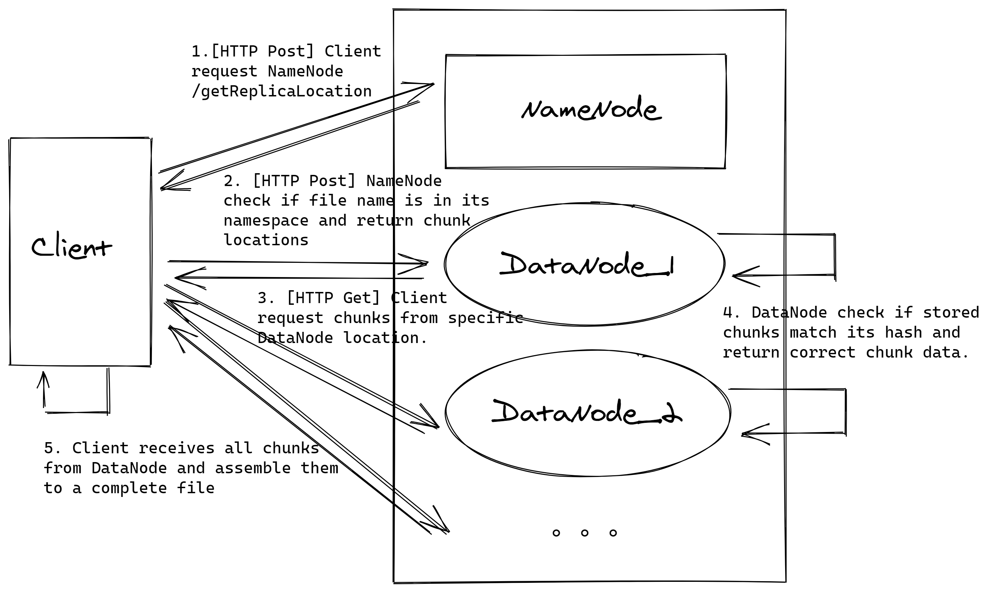
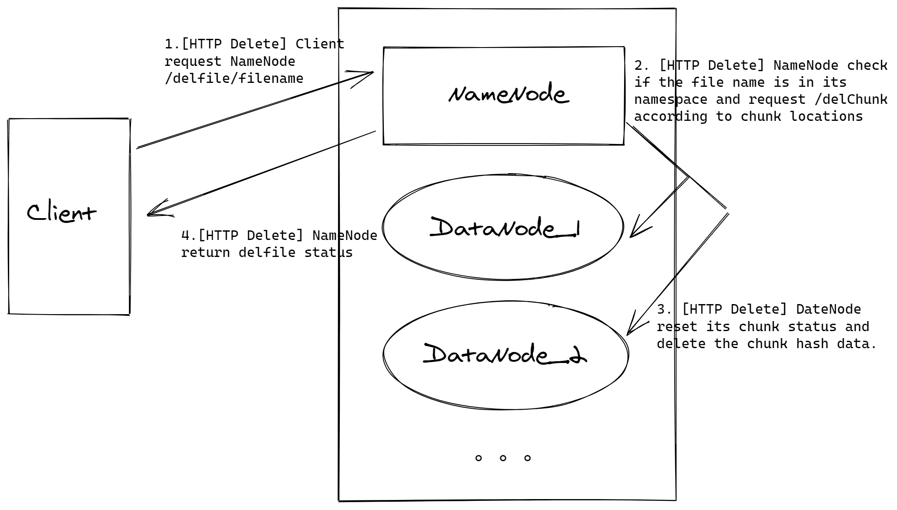
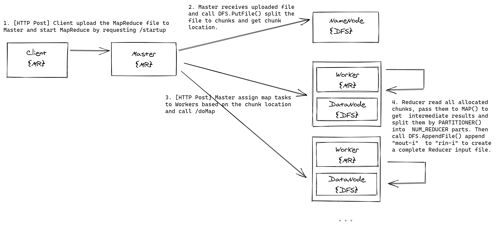
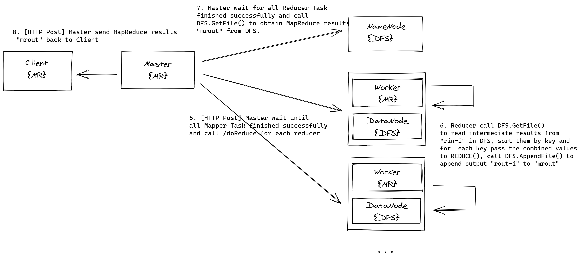

# MR-DFS
It's a simple implementation of a MapReduce system on top of a customized DFS(Distributed File System).  The system is designed under reference of the idea of [​​gfs](https://dl.acm.org/doi/pdf/10.1145/945445.945450) and [mapreduce](https://dl.acm.org/doi/abs/10.1145/1327452.1327492) paper. Also, we use Docker to simulate a ditributed environment on a single host and the system is implemented with golang. For the DFS part, we refactor an existing project [TDFS](https://github.com/treasersimplifies/TinyDFS) which you can learn more about it in `README.old.md`, to make it more suitable for mapreduce work.

## How to play with it?
To run it on your local machine, You need these prequisite installed:
- docker
- docker-compose
- golang

After all these above are set, just use the script `sudo ./reset.sh`, you will have a distributed system ready in docker. Also, if you want to communicate with your docker containers from host, I suggest you to [make this change](https://stackoverflow.com/a/63656003) to your system which is basically update your local dns according to the docker service name.

## Project Structure

```
├── Client.go  // a command line dfs client based on functions in src/tdfs/client.go 
├── DN.go	   // start a dfs datanode based on src/tdfs/datanode.go
├── NN.go	   // start a dfs namenode based on src/tdfs/namenode.go
├── Master.go  // start a mapreduce master based on src/mr/master.go
├── Worker.go  // start a mapreduce worker based on src/mr/worker.go
├── TinyDFS       // dfs work dir (shared by several docker containers with docker data volume)
    ├── DataNode1 // chunks directory of datanode1
    │   └── achunkhashs //chunks hash directory of datanode1
    ├── DataNode2 // chunks directory of datanode2
    │   └── achunkhashs //chunks hash directory of datanode2
    ├── NameNode 	// work dir of namenode
    ├── TDFSLog.txt // DFS log
    ├── MRLog.txt // MapReduce log
├── MR            // mapreduce work dir (used to store intermediate file and output file)
├── src				
    └── tdfs    // DFS source code
          ├── client.go 	// client related operations
          ├── datanode.go	// datanode related operations
          ├── namenode.go // namenode related operations
          ├── tdfslog.go 	// dfs logger
          ├── config.go  	// dfs data structures and global settings
          └── utils.go	 	// some utility functions
    └── mr    // MapReduce source code
          ├── UserDefined.go 	// map(), reduce(), partitioner() functions get from user
          ├── worker.go	// worker related operations
          ├── master.go // master related operations
          ├── mrlog.go 	// mapreduce logger
          ├── config.go  	// mapreduce data structures and global settings
├── reset.go	   // a bash script to start or restart all nodes in docker containers
├── startClient.go	   // a bash script to start a Client (datanode and worker)
├── startMaster.go	   // a bash script to start a Master (namenode and master)
├── docker-compose.yml	   // cluster settings (currently 1 master and 5 client)
```

## System Design

整个系统由两部分组成——MapReduce和DFS。两部分完全解耦，MapReduce通过调用DFS提供的接口使用分布式存储的功能实现分布式计算。

### 分布式文件系统

分布式文件系统的设计从Google File System里借鉴了很多思想，采用主从式架构，由一个名称节点NameNode和多个数据节点DataNode组成。名称节点保存数据节点的信息（如数据节点的位置和状态）和文件的基本信息（包括文件大小，文件块chunk的位置，文件名等）以及文件系统的基本设置（如冗余数，端口号等）。数据节点保存数据节点的状态（存储总容量，存储剩余容量）以及chunk的信息（chunk的内容和chunk的hash值）。

整个文件系统实现的目的是为上层的MapReduce任务服务。所以我们在设计实现时做了一些权衡。例如，考虑到MapReduce的现实需要，我们在正常的get, put, delete之外，添加了append的接口，方便上层任务的实现；另外，考虑到简单的mapreduce任务不需要复杂的文件目录结构，所以我们舍弃了在namenode上维护一个树形目录结构的功能。

文件系统还提供一个简单的客户端为与文件系统的交互提供了入口。我们为文件系统实现了几个基本的接口——`GetFile`, `PutFile`, `AppendFile`,`DelFile` . 下面依次介绍各个接口的具体实现。

#### `PutFile & AppendFile` 

 `PutFile`, `AppendFile`的实现流程很相似所以我们在这里一起说明。
 
 首先，客户端在本地把要上传的文件分块，之后把分块信息（不是分块文件）通过`/getReplicaLocation`发送给名称节点。这里我们选择让分块步骤发生在客户端而不是名称节点，有两点考虑。首先是我们希望尽量减少网络传输对系统造成的影响，只传递文件信息而不是文件内容能够节省带宽资源。另外，我们希望尽量减少名称节点的负载尽量使其不成为整个系统的瓶颈，为此我们甚至可以牺牲实现的复杂度来让其他节点分担名称节点的任务。
 
名称节点拿到文件分块信息后，更新自己的namespace。`PutFile`和`AppendFile`的区别就体现在这一步。对于`PutFile`，名称节点新建一个文件到chunk的映射关系；而对于`AppendFile`，名称节点需要更新原有的映射。名称节点将根据数据节点的负载情况和冗余设置为chunk分配适当的存储位置，并将这些信息返回给客户端。另外，为了应对并发访问的需求，在修改namespace的过程中我们需要互斥锁保护修改的内容。
 
 客户端收到chunk的存储信息后，把各个chunk按照它们的存储位置发送到各个数据节点。数据节点收到chunk，保存它的内容并且根据内容计算和保存它的hash值。


#### `GetFile` 


和`PutFile`一样，`GetFile`首先需要客户端从名称节点拿到chunk的存储信息。之后客户端通过返回的位置信息去相应的数据节点请求具体的chunk。数据节点在收到客户端的请求后首先计算出chunk的hash值并且把它与之前保存块时的hash值进行比较。如果二者不一致，说明这个chunk已经损坏，数据节点就直接返回错误信息。客户端根据HTTP的返回值发现该节点返回错误信息，就去请求该块的其他位置。当客户端收到所有的块内容，它在本地把这些块重新组装成为一个完整的文件。


#### `DelFile` 


删除文件的做法和其他接口的实现不太一致，当名称节点收到来自客户端的删除请求后，它直接向保存该文件的所有块的数据节点发送删除请求，而不是把位置信息发送回客户端，再由客户端去向各个数据节点发送删除请求。这是因为删除文件的流程不涉及文件数据信息的传输，而只是一些控制信息的传输，没有必要为了节省名称节点的带宽让客户端来处理。而且名称节点可以在删除namespace中文件信息后，立刻释放锁，这样删除文件之后和数据节点直接通信也不会阻塞收到的其他请求。


### 分布式计算

分布式计算部分，我们基于上一部实现的简单的分布式文件系统实现了一个简单的MapReduce任务框架。

MapReduce系统由master节点和worker节点组成。master节点负责调度任务，worker节点完成具体的map和reduce任务。
worker节点需要和分布式文件系统里的数据节点部署到一起，master节点没有限制，在我们的实现里，我们把它部署到分布式文件系统的名称节点上。

#### Map阶段


一个完整的MapReduce任务由客户端发起。客户端通过请求master节点的`/startup`，将mapreduce需要用到的数据文件上传到master。master收到客户端上传的文件后，通过DFS的提供的`PutFile()`接口，把文件存储到分布式文件系统里。在存储的过程中文件分块的工作就由DFS完成了。

接着master根据DFS返回的分块存储位置信息，安排Map阶段的工作。Map任务的分配遵循就近原则，即chunk在哪个数据节点，就把Map的任务分配给那个节点上的Worker. 把所有的块都分配到对应的Worker后，master请求对应worker的`/doMap`接口，并且把worker需要的具体块位置信息发送给它。

worker在`/doMap`里开始执行自己的Map任务。worker根据master发送的块信息，读取本地的数据节点中存储的数据块文件。接着把读取的内容传入用户定义的`map()`函数。之后worker把`map()`函数处理后的结果根据用户定义的`partitioner()`函数进行切分，分成`n`个文件`mout-i`。`n`是MapReduce定义的reducer的数目。接着，worker调用DFS的`AppendFile()`接口把这`n`个文件分别append到`rin-i`这`n`个文件。

这里我们的实现和MapReduce论文中的做法有所不同。在论文中没有出现append这一步骤。reduce阶段，每个reducer都是通过一个`remoteCopy`的步骤从多个做map的worker上读取它们的输出，接着组装成一个完整的文件作为输入。我们的做法是由worker做完map工作后直接把自己的输出文件append到对应的位置`rin-i`。这样reducer需要时只需要从DFS里直接读取即可。


#### Reduce阶段


master等到所有worker的map工作都成功完成后，立刻向worker的`/doReduce`接口发送请求，向worker分配reduce任务。

worker从DFS中读取reduce任务的输入文件`rin-i`。中间文件都是以键值对的形式来存储的，接着将文件的内容按照key来进行排序，并且将相同key的value合并到一个数组中。对于每一个key，worker把它以及合并后的数组传入用户定义的`reduce()`函数里。最后通过DFS的接口`AppendFile()`将输出的结果append到mapreduce最终的输出文件`mrout`里。

master等待所有的worker的reduce任务都结束后，直接从DFS里读取`mrout`即整个mapreduce的输出文件，并且把这个文件的结果传回客户端。


## 其他

### 文件分块方法

文件分块的工作是在分布式文件系统的客户端完成的。

```go
// Split the file to chunks
func SplitToChunksByName(fPath string) (chunklist []ChunkUnit, offsetLast int, fileLen int) {
	data := ReadFileByBytes(fPath)
	var i int = 0
	fileLen = len(data)
	for i < fileLen/CHUNK_SIZE {
		chunklist = append(chunklist, data[i*CHUNK_SIZE:(i+1)*CHUNK_SIZE])
		i++
	}
	chunklist = append(chunklist, data[i*CHUNK_SIZE:])
	offsetLast = fileLen - i*CHUNK_SIZE
	return chunklist, offsetLast, fileLen
}

// ReadFileByBytes parse the file by fileName to bytes
func ReadFileByBytes(fileName string) []byte {
	file, err := os.Open(fileName)
	defer func() {
		file.Close()
	}()
	if err != nil {
		fmt.Println("XXX Utils error at readFileByBytes(open): ", err.Error())
		TDFSLogger.Panic("XXX Utils error at readFileByBytes(open): ", err)
	}
	data, err := ioutil.ReadAll(file)
	if err != nil {
		fmt.Println("XXX Utils error at readFileByBytes(ReadAll): ", err.Error())
		TDFSLogger.Panic("XXX Utils error at readFileByBytes(ReadAll): ", err)
	}
	return data
}
```

我们首先定义了一个函数`ReadFileByBytes()`读取输入文件的内容，并且把内容以byte数组的形式存起来。接着根据DFS里定义的`CHUNK_SIZE`把整个byte数组切分成不同的chunk，返回一个chunkList。

### 文件备份方法

文件系统的冗余系数是在DFS里事先定义的一个常量`REDUNDANCE`。另外我们定义了一个数据结构`FileChunk`用来保存chunk的位置信息。

```go
type FileChunk [REDUNDANCE]ReplicaLocation
type ReplicaLocation struct {
	ServerLocation string `json:"ServerLocation"`
	ReplicaNum     int    `json:"ReplicaNum"`
}
```

 在DFS里为每一个chunk分配位置时，名称节点检查每个数据节点的存储余量，选择其中存储余量最多的节点分配当前chunk的位置。

```go
func (namenode *NameNode) AllocateChunk() (rlList [REDUNDANCE]ReplicaLocation) {
	var max int
	for i := 0; i < namenode.REDUNDANCE; i++ {
		max = 0
		for j := 0; j < namenode.DNNumber; j++ {
			if namenode.DataNodes[j].StorageAvail > namenode.DataNodes[max].StorageAvail {
				max = j
			}
		}

		if len(namenode.DataNodes[max].ChunkAvail) == 0 {
			fmt.Println("XXX NameNode error: no available datanode")
			TDFSLogger.Panic("XXX NameNode error: no available datanode")
		}

		// choose the datanode which has max available capacity
		selectedDN := &namenode.DataNodes[max]
		rlList[i].ServerLocation = selectedDN.Location
		rlList[i].ReplicaNum = selectedDN.ChunkAvail[0]

		// update datanode metadata
		updateDataNodeMetadata(selectedDN)
	}

	return rlList
}
```

### 文件的一致性策略

在`GetFile`的过程中，客户端从名称节点拿到chunk位置信息后，向各个数据节点请求对应的chunk。数据节点会在返回chunk前做一次hash检查，判断chunk内容是否正确。如果不正确它会直接返回错误信息。

```go
router.GET("/getchunk/:chunknum", func(c *gin.Context) {
		chunknum := c.Param("chunknum")
		num, err := strconv.Atoi(chunknum)
		if err != nil {
			fmt.Println("XXX DataNode error(getchunk) at Atoi parse chunknum to int", err.Error())
			TDFSLogger.Panic("XXX DataNode error: ", err)
		}
		fmt.Println("Parsed num: ", num)

		chunkBytes := ReadFileByBytes(datanode.DATANODE_DIR + "/chunk-" + strconv.Itoa(num))
		chunkHash := ReadFileByBytes(datanode.DATANODE_DIR + "/achunkhashs/chunkhash-" + strconv.Itoa(num))

		/* check hash */
		hashStr := GetHashStr(chunkBytes)
		fmt.Println("*** chunk hash calculated: ", hashStr)
		fmt.Println("*** chunk hash get: ", string(chunkHash))

		if hashStr == string(chunkHash) {
			c.String(http.StatusOK, string(chunkBytes))
		} else {
			c.String(http.StatusExpectationFailed, "")
			fmt.Println("X=X the broken chunk-", num, "'s hash(checksum) is WRONG")
			TDFSLogger.Panic("XXX Broken chunk found at ", num)
			// broken chunk, something could be done to recover it
		}

	})
```

当名称节点需要同时处理多个请求时（即并发场景下），名称节点的namespace信息可能会被多个线程访问。所以我们把涉及namespace的修改操作都加上了一个互斥锁，保证数据一致性。

```go
////// File to Chunk
type NameSpaceStruct struct {
	NameSpaceMap map[string]File
	mu           sync.Mutex
}
```

### 计算任务分配机制

分布式计算主要分为map和reduce两个阶段。map阶段的任务分配主要是根据`DFS.PutFile`返回的chunk位置信息，遵循就近原则，即把chunk的map任务分配给chunk所在的数据节点对应的worker上。因为每个chunk有多个冗余，我们这里就直接选择冗余列表里的第一个位置对应的worker作为mapper。对于reduce任务的分配，我们基于append的实现对此没有任何偏好。最终我们选择所有的数据节点上空闲的worker来完成reduce任务。

```go
func (master *Master) addChunkToMapper(chunk tdfs.ReplicaLocation) {
	found := false
	for _, mapper := range master.Mappers {
		if mapper.Worker.WorkerAddr == chunk.ServerLocation {
			mapper.Chunks = append(mapper.Chunks, chunk.ReplicaNum)
			found = true
			break
		}
	}
	if !found {
		mapper := Mapper{Worker{chunk.ServerLocation, false}, []int{chunk.ReplicaNum}}
		master.Mappers = append(master.Mappers, &mapper)
	}
}
```

### 可以改进的地方
- 更好的容错控制，在现在的文件系统中我们发现出错的chunk后，会跳过该备份但是没有其他处理，可以添加一个recover的过程。MapReduce系统中，当master发现worker出错后，只会报错，不能利用其它节点来处理出错节点的任务。
- 现有的appendfile没有利用last_offset信息，默认从下一个新的chunk开始分配，存在浪费空间的问题。
- 自动化部署。现有的配置信息都是写死在各个配置文件里，可以整合到一个文件中，修改一个文件自动部署整个集群。